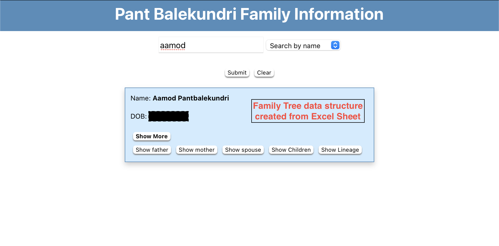

# pb-info

This is a project to create a digital family tree of the members of my family.

## Process
1. A google form was sent out to my direct family members. It asked for basic information like name, parents name etc.
2. Everyone was asked to send it ahead to other members in the family.
3. The resulting Microsoft Excel sheet with everyone's entries, was used to create the Tree Data Structure.
4. All rows were scanned to figure out how everyone was related to everyone else.
5. ID's were created for all members, to differentiate between same names.
6. Pre-processsing was done for all data, to account for discrepencies. For example, one child writing their parent's name as Chris, but another 
child writes it as Christopher.
7. All this data was hosted on a github page webb app, created using `React`.

## Tree Data Strucuture
All nodes of the tree represent a member of the family. It had class variables such as an array of `children`, 2 `parent`s, and variables for their own data.

The most useful class Method is `get_ancestry(person)`. Calling this, starts from the node of the specified person, and navigates upwards. This gives the direct
lineage of that person.

## Web Application
Given the sensitive information of all people involved, the page is restricted with a login prompt, also created in `React`.

Keeping in mind the privacy issues, here are some screenshots from the web app, with all sensitive information being censored:

1. Person's info card after searching for them.  

2. Extended info card  

3. Login Prompt (staged for screenshot, not actual credentials)  

4. Options on person's info card  

